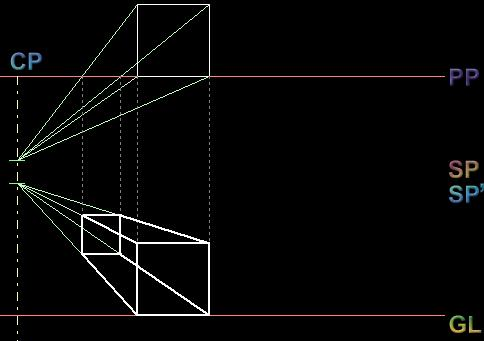



## Perspective View

### Description

Perspective View is a software which shows the perspective/view projection of a cube. This program will be extremely useful for engineering students to understand the basics of perspective view. It includes an option to view the visual rays which will eventually create a perspective view. Those who are unaware of the topic will also find this program interesting to view how the shape of a cube varies as we look it at from various angles.

If you like this game, please encourage me by giving your extremely valuable votes.
 
### More Info
 

             |
---                |---
**Submitted On**   |2005-08-28 19:55:56
**By**             |[Sandeep\.G](https://github.com/Planet-Source-Code/PSCIndex/blob/master/ByAuthor/sandeep-g.md)
**Level**          |Intermediate
**User Rating**    |5.0 (20 globes from 4 users)
**Compatibility**  |VB 6\.0
**Category**       |[Graphics](https://github.com/Planet-Source-Code/PSCIndex/blob/master/ByCategory/graphics__1-46.md)
**World**          |[Visual Basic](https://github.com/Planet-Source-Code/PSCIndex/blob/master/ByWorld/visual-basic.md)
**Archive File**   |[Perspectiv192956942005\.zip](https://github.com/Planet-Source-Code/sandeep-g-perspective-view__1-62432/archive/master.zip)

